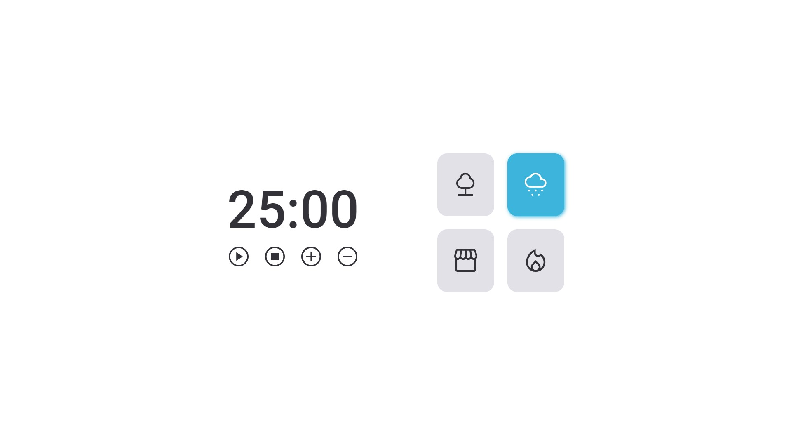

<h1 align="center"> Timer Focus </h1>

Projeto feito como desafio e lógica com JavaScript 

  <a href="#-tecnologias">Tecnologias</a>&nbsp;&nbsp;&nbsp;|&nbsp;&nbsp;&nbsp;
  <a href="#-projeto">Projeto</a>&nbsp;&nbsp;&nbsp;|&nbsp;&nbsp;&nbsp;
  <a href="#memo-licença">Licença</a>

 

  

## 🚀 Tecnologias

Esse projeto foi desenvolvido com as seguintes tecnologias:

- HTML e CSS
- JavaScript
- Git e Github
- Figma

## 💻 Projeto

Um temporizador com sons para auxiliar no tempo de estudo.

- [Visite meu projeto online](https://raphetes.github.io/TimerFocus)

---

[Participe da comunidade da Rocketseat no discord!](https://discord.gg/rocketseat)
